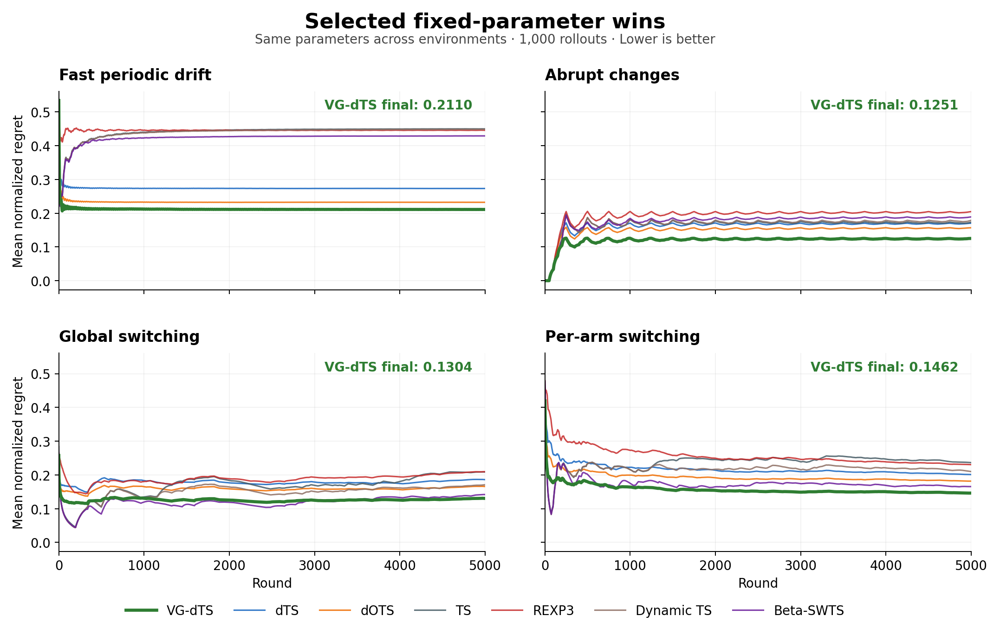
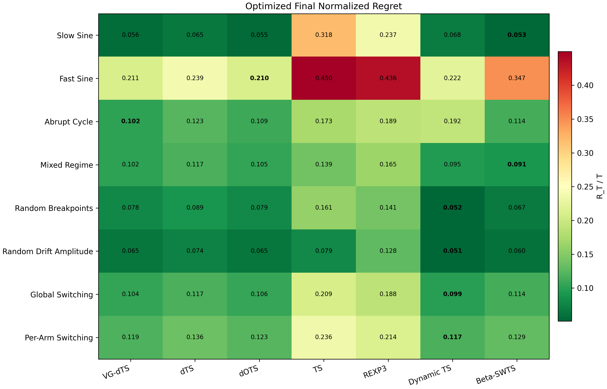
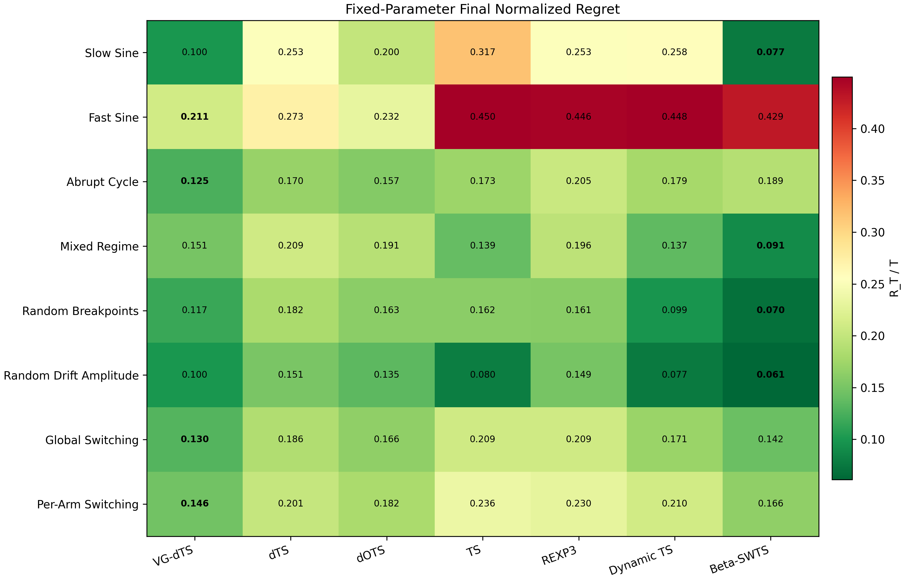

# Variance-Gated Discounted Thompson Sampling

**Mayand Gulati · Kerong Wang · Wei-Chen Au** — University of California, Santa Barbara

[Paper](report/ECE_270_Project_Publication/main.tex) · [Reproduce the results](REPRODUCIBILITY.md) · [Reference results](results/paper/)

Thompson Sampling learns from history. In a changing environment, that history
can become a liability. **VG-dTS adapts how quickly each arm forgets**, using
variation in posterior prediction errors to adjust its discount factor online.
Across eight non-stationary Bernoulli bandit environments, it achieves the lowest
average normalized regret among the seven methods evaluated under both the
paper's tuned and fixed-parameter protocols.

## The algorithm

VG-dTS maintains a Beta posterior for each arm and repeats three steps:

1. **Select and observe.** Sample from each posterior, choose an arm, and observe
   its reward. The reported experiments use optimistic scores: the larger of
   each sample and its posterior mean.
2. **Estimate volatility.** Standardize the played arm's prediction error and
   update an exponentially weighted estimate of its variability. Higher
   estimated volatility maps to a smaller discount factor.
3. **Gate, forget, and update.** Blend that discount with a default using
   effective sample size, discount every arm's evidence toward the prior, then
   add the observed reward to the played arm's posterior.

The prior-preserving forgetting step is

$$
\alpha_k \leftarrow 1 + \gamma_{k,t}(\alpha_k - 1),
\qquad
\beta_k \leftarrow 1 + \gamma_{k,t}(\beta_k - 1).
$$

Smaller $\gamma_{k,t}$ means shorter memory. The reliability gate controls how
strongly volatility determines that memory; with $n_0=0$, as in the fixed
protocol, it opens fully once an arm has positive effective evidence.

## Results

We compare VG-dTS with **TS, dTS, dOTS, REXP3, Dynamic TS, and Beta-SWTS** over
smooth drift, abrupt shifts, mixed dynamics, and stochastic switching
($K=4$, $T=5000$). The metric is cumulative dynamic-oracle mean reward minus
realized reward, divided by the horizon and averaged over rollouts; lower is
better.

**Regret over time.** With fixed parameters, VG-dTS has the lowest final
normalized regret in these four of the eight environments. Its largest lead
over the next-best method is in abrupt changes: **20.2% below dOTS**.



**Tuned per environment.** VG-dTS achieves average normalized regret **0.1047**,
compared with **0.1200** for dTS and **0.1067** for dOTS.



**Fixed across environments.** VG-dTS achieves **0.1351** average normalized
regret: **33.5% lower than dTS** and **24.2% lower than dOTS** under the reported
fixed settings.



These are suite averages, not wins in every environment. Surprise is an indirect
signal of change: random switching can favor other methods, and the
pure-random-signal control leaves little room for any method to improve.

## Run it

Use **Python 3.12** and the pinned dependencies; NumPy 2.x changes the breakpoint
environment generated from the same seed.

```sh
python3.12 -m venv .venv
. .venv/bin/activate
python -m pip install -r requirements.txt
python -m pip install --no-deps -e .
python -m project_publication --mode paper --workers 4
python -m project_publication --mode verify
```

This replays the archived hyperparameters with **1,000 evaluation runs** and
writes figures, curves, and summaries to `artifacts/reproduction/`. Choose a new
`--output-dir` if it already contains a run. All **119 reported evaluation
values** were reproduced exactly during validation. Full retuning, a quick smoke
test, manuscript compilation, and methodological caveats are documented in the
[reproducibility guide](REPRODUCIBILITY.md).
